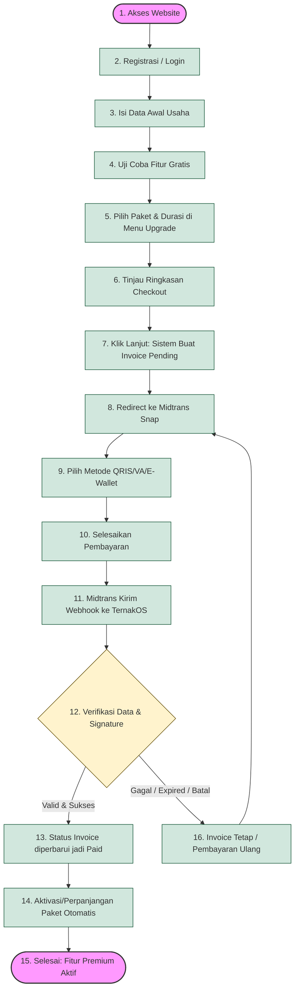

# Alur End-to-End Pemesanan dan Pembayaran TernakOS

Dokumen ini menjelaskan alur lengkap (*end-to-end process*) pelanggan dalam memesan layanan dan melakukan pembayaran pada platform **TernakOS**. 

---

## 🗺️ Diagram Alur Proses (Flowchart)

Berikut adalah visualisasi alur pemesanan dan pembayaran dari awal hingga aktivasi layanan:

---

## 📝 Penjelasan Tahapan Alur E2E

### 1. Akses dan Registrasi Akun
1. **Mengakses Halaman**: Customer membuka website utama TernakOS melalui URL [https://ternakos.my.id](https://ternakos.my.id).
2. **Autentikasi**: Customer melakukan pendaftaran akun (*registrasi*) baru atau masuk (*login*) menggunakan alamat email mereka.

### 2. Pengisian Data Awal Usaha
3. **Konfigurasi Awal**: Setelah berhasil masuk ke dalam aplikasi, customer mengisi data awal profil usaha peternakannya, seperti jenis usaha/spesies ternak, nama usaha, serta preferensi operasional yang akan digunakan di platform TernakOS.

### 3. Fase Uji Coba (Trial) & Keputusan Upgrade
4. **Uji Coba Fitur Gratis**: Customer dapat menggunakan akun gratis terlebih dahulu untuk mencoba fitur-fitur dasar TernakOS. Jika membutuhkan kapasitas lebih besar atau fitur premium lengkap, customer dapat menekan tombol/menu upgrade ke paket berbayar.
5. **Pemilihan Paket**: Di halaman upgrade/subscription, customer memilih paket berlangganan yang diinginkan (seperti paket Pro atau Business) serta memilih durasi waktu berlangganan (bulanan/tahunan).

### 4. Proses Checkout dan Pembuatan Invoice
6. **Ringkasan Tagihan**: Sistem menampilkan detail checkout yang berisi:
   * Nama paket yang dipilih.
   * Durasi berlangganan.
   * Harga paket dasar.
   * Potongan harga (apabila menggunakan kode voucher).
   * Total akhir nilai tagihan yang harus dibayar.
7. **Pembuatan Order**: Ketika customer menekan tombol **Lanjut Bayar** atau **Checkout**, sistem backend TernakOS membuat data transaksi invoice baru di database dengan status `pending`.

### 5. Pembayaran dengan Midtrans
8. **Pengalihan Halaman**: Customer diarahkan ke antarmuka pembayaran Midtrans Snap.
9. **Metode Pembayaran**: Customer memilih opsi pembayaran yang diinginkan (QRIS, E-Wallet seperti GoPay/ShopeePay, Virtual Account bank, atau metode lain yang aktif).
10. **Penyelesaian Pembayaran**: Customer menyelesaikan pembayaran menggunakan perangkat atau aplikasi perbankan/e-wallet mereka.

### 6. Verifikasi Sistem dan Aktivasi Layanan
11. **Notifikasi Webhook**: Setelah pembayaran berhasil diproses di jaringan bank/e-wallet, Midtrans mengirimkan notifikasi instan (*webhook*) ke API TernakOS.
12. **Verifikasi Keamanan**: Sistem TernakOS melakukan pencocokan data notifikasi tersebut:
    * Mencocokkan Order ID / Invoice.
    * Memvalidasi nominal transfer.
    * Memeriksa status transaksi dari Midtrans.
    * Memvalidasi keamanan tanda tangan enkripsi (*signature key*).
13. **Aktivasi Otomatis**: Jika verifikasi lolos, sistem TernakOS otomatis mengubah status invoice menjadi `paid` / `success`, lalu menambah atau memperpanjang masa aktif paket subscription akun customer tersebut.
14. **Penggunaan Fitur**: Customer dapat kembali ke aplikasi TernakOS untuk langsung menggunakan semua fitur premium sesuai paket yang baru diaktifkan.

### 7. Penanganan Pembayaran Gagal
15. **Pembayaran Gagal / Expired**: Jika proses transfer gagal, waktu pembayaran habis (*expired*), atau dibatalkan, status invoice akan tetap disesuaikan dengan status laporan terakhir. Customer dapat memicu pembayaran ulang melalui tombol yang tersedia pada riwayat tagihan di aplikasi.

---

## 💡 Informasi Penting

> [!NOTE]
> **Produk Digital (SaaS/Software Subscription)**  
> Layanan yang dibeli berupa hak akses software berbasis durasi waktu (subscription). Tidak ada pengiriman barang fisik ke alamat customer.

> [!TIP]
> **Aktivasi Instan**  
> Proses aktivasi paket pasca-pembayaran diproses secara *real-time* lewat webhook otomatis tanpa memerlukan verifikasi manual dari admin.

> [!IMPORTANT]
> **Bukti Pembayaran**  
> Seluruh invoice dan riwayat pembayaran tersimpan rapi dan dapat diunduh kapan saja oleh customer melalui menu **Billing Portal / Riwayat Tagihan** di dalam aplikasi TernakOS.
