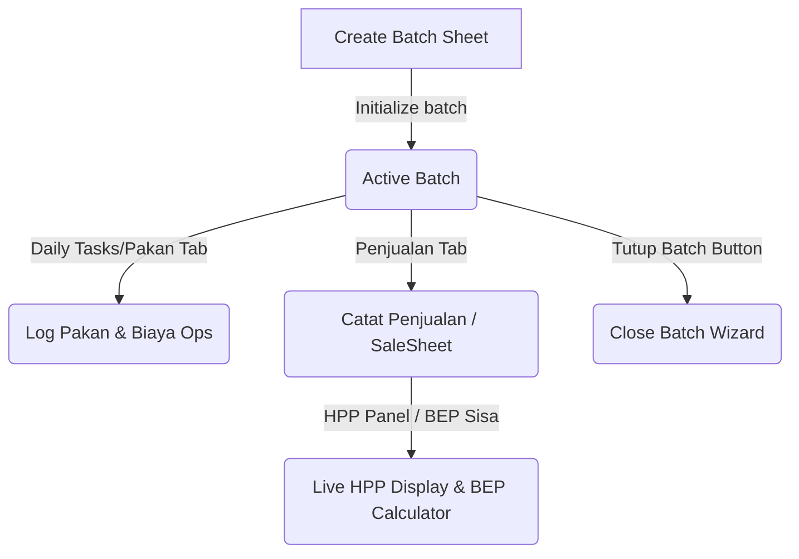

# Phase 0A — Frontend/Codebase Audit Report: HPP Mode Sederhana & Detail Penggemukan

This document summarizes the codebase audit performed for the planned **Mode Hitung HPP Penggemukan** feature on TernakOS. The objective is to identify safest integration points, locate existing logic, outline new component structures, and highlight risks while strictly avoiding any code or database modifications.

---

## 1. Files Inspected

The following files across the peternak (fattening) vertical were analyzed:

### Animal Fattening Wrappers
*   [`src/dashboard/peternak/domba/fattening/Batch.jsx`](file:///d:/Dokumen/02_Kerja_Profesional/Ternak%20OS/src/dashboard/peternak/domba/fattening/Batch.jsx)
*   [`src/dashboard/peternak/kambing/fattening/Batch.jsx`](file:///d:/Dokumen/02_Kerja_Profesional/Ternak%20OS/src/dashboard/peternak/kambing/fattening/Batch.jsx)
*   [`src/dashboard/peternak/sapi/fattening/Batch.jsx`](file:///d:/Dokumen/02_Kerja_Profesional/Ternak%20OS/src/dashboard/peternak/sapi/fattening/Batch.jsx)
*   [`src/dashboard/peternak/domba/fattening/Penjualan.jsx`](file:///d:/Dokumen/02_Kerja_Profesional/Ternak%20OS/src/dashboard/peternak/domba/fattening/Penjualan.jsx)
*   [`src/dashboard/peternak/kambing/fattening/Penjualan.jsx`](file:///d:/Dokumen/02_Kerja_Profesional/Ternak%20OS/src/dashboard/peternak/kambing/fattening/Penjualan.jsx)
*   [`src/dashboard/peternak/sapi/fattening/Penjualan.jsx`](file:///d:/Dokumen/02_Kerja_Profesional/Ternak%20OS/src/dashboard/peternak/sapi/fattening/Penjualan.jsx)

### Shared Fattening Components
*   [`src/dashboard/peternak/_shared/components/penggemukan/PenggemukanBatch.jsx`](file:///d:/Dokumen/02_Kerja_Profesional/Ternak%20OS/src/dashboard/peternak/_shared/components/penggemukan/PenggemukanBatch.jsx) — Batch list, `CreateBatchSheet`, and `CloseBatchWizard`.
*   [`src/dashboard/peternak/_shared/components/penggemukan/PenggemukanPakan.jsx`](file:///d:/Dokumen/02_Kerja_Profesional/Ternak%20OS/src/dashboard/peternak/_shared/components/penggemukan/PenggemukanPakan.jsx) — Log pakan & operational costs input flow (`BiayaTab` / `handleAddCost`).
*   [`src/dashboard/peternak/_shared/components/penggemukan/PenggemukanPenjualan.jsx`](file:///d:/Dokumen/02_Kerja_Profesional/Ternak%20OS/src/dashboard/peternak/_shared/components/penggemukan/PenggemukanPenjualan.jsx) — Sales listing, `HppPanel`, `MarginAnalyzer`, and `SaleSheet`.

### Hook Files
*   [`src/lib/hooks/createPenggemukanHooks.js`](file:///d:/Dokumen/02_Kerja_Profesional/Ternak%20OS/src/lib/hooks/createPenggemukanHooks.js) — Factory hooks for Domba & Kambing fattening (contains `useHppBatch`).
*   [`src/lib/hooks/useDombaPenggemukanData.js`](file:///d:/Dokumen/02_Kerja_Profesional/Ternak%20OS/src/lib/hooks/useDombaPenggemukanData.js) — Re-exports factory-generated hooks.
*   [`src/lib/hooks/useKambingPenggemukanData.js`](file:///d:/Dokumen/02_Kerja_Profesional/Ternak%20OS/src/lib/hooks/useKambingPenggemukanData.js) — Re-exports factory-generated hooks.
*   [`src/lib/hooks/useSapiPenggemukanData.js`](file:///d:/Dokumen/02_Kerja_Profesional/Ternak%20OS/src/lib/hooks/useSapiPenggemukanData.js) — Specialized Sapi hooks (contains Sapi-specific `useSapiHppBatch`).

---

## 2. Current Frontend Flow Summary



### A. Create Batch Flow
*   Triggered from `PenggemukanBatch.jsx` → `CreateBatchSheet` using `hooks.useCreateBatch()`.
*   Form fields: `batch_code` (auto-generated alphanumeric), `kandang_name` (locked/unlocked default to tenant business name), `start_date`, `target_end_date` (optional), and `notes`.
*   Sapi uses `useCreateSapiBatch` inside `useSapiPenggemukanData.js` (forces `batch_purpose: 'potong'`). Domba/Kambing use factory `useCreateBatch` in `createPenggemukanHooks.js`.

### B. Operational Cost / Pakan / Overhead Input Flow
*   Pakan consumption logged in `PenggemukanPakan.jsx` via `handleSubmit` calling `hooks.useAddFeedLog`.
*   Operational costs (other costs like pakan purchase, water/electricity, medical, wages, etc.) logged in `BiayaTab` via `handleAddCost` calling `hooks.useAddOperationalCost`.
*   Proportional split allocation across active batches by headcount (`total_animals`) is computed when the "Biaya Bersama" (`is_shared`) toggle is checked. It splits both the cash amount (`amount_idr`) and quantity (`quantity`).

### C. HPP Calculation & Display Flow
*   Handled dynamically by `<HppPanel batchId={batchId} useHppBatch={hooks.useHppBatch} />` inside `PenggemukanPenjualan.jsx`.
*   It exposes variables like `totalModalBeli`, `totalBiayaPakan`, `totalBiayaOpsLain`, `totalBiayaGajiOverhead`, `totalBiayaKesehatan`, `totalHpp`, `hppPerEkor`, `bepPerEkor`, `bepSisa` to show live charts, breakdowns, and warnings (e.g. "pakan tanpa biaya" or "ternak tanpa harga beli").

### D. Penjualan & Tutup Batch Flow
*   **Penjualan (Sales)**: Handled by `SaleSheet` in `PenggemukanPenjualan.jsx`. Users pick active animals, log purchase details, price type (per head/per kg), and trigger `hooks.useAddSale`. It updates status of selected animals to `'sold'`.
*   **Tutup Batch**: Handled by `CloseBatchWizard` in `PenggemukanBatch.jsx`. It shows final KPI metrics (sold, dead, active counts, revenue, expenses, net profit/loss, R/C Ratio) and prompts user to audit/verify final costs before calling `hooks.useCloseBatch`.

---

## 3. Existing HPP Detail Logic Location

Existing HPP Detail logic is isolated in two distinct places:

### A. Domba & Kambing (Factory)
*   **File**: [`src/lib/hooks/createPenggemukanHooks.js`](file:///d:/Dokumen/02_Kerja_Profesional/Ternak%20OS/src/lib/hooks/createPenggemukanHooks.js#L1417-L2005)
*   **Function**: `useHppBatch(batchId)`
*   **Logic Characteristics**:
    *   **Modal Beli**: Simple sum of `purchase_price_idr`.
    *   **Pakan Cost**: Consumed volume × weighted avg purchase price per kg (derived from `category = 'pakan'` rows in `operational_costs`). Falls back to cash basis if quantity is not recorded.
    *   **Overhead Periodik Harian**: Dynamically allocated daily worker payments from `kandang_worker_payments` based on daily active animal headcount proportion. Uses `allAnimalsForType` to rebuild daily cohorts.
    *   **Kesehatan**: Sum of medicine/treatment costs in `health_logs`.
    *   **Biaya Ops**: Sum of non-pakan, non-gaji rows in `operational_costs`.

### B. Sapi (Specialized)
*   **File**: [`src/lib/hooks/useSapiPenggemukanData.js`](file:///d:/Dokumen/02_Kerja_Profesional/Ternak%20OS/src/lib/hooks/useSapiPenggemukanData.js#L878-L947)
*   **Function**: `useSapiHppBatch(batchId)`
*   **Logic Characteristics**:
    *   **Pakan Cost**: Consumed volume × weighted avg purchase price derived from `operational_costsByBatches` (returns empty list currently).
    *   **Biaya Ops**: Proportional share of farm operational costs (excluding pakan) split by active animal count.
    *   **Overhead**: Currently not calculated in Sapi fattening HPP.

---

## 4. Suggested New Files/Components

To prevent mixing simple and detailed UI code, we suggest creating the following new visual assets:
1.  **`src/dashboard/peternak/_shared/components/penggemukan/hpp/HppModeBadge.jsx`**: Displays a badge (e.g. `SIMPLE` in emerald or `DETAIL` in violet) on the batch cards and HppPanel.
2.  **`src/dashboard/peternak/_shared/components/penggemukan/hpp/SimpleHppBreakdown.jsx`**: A simplified breakdown widget for cash-basis HPP (Modal Beli + Biaya Ops + Biaya Pakan Cash Basis, with no animal-days overhead).
3.  **`src/dashboard/peternak/_shared/components/penggemukan/hpp/QuickAllocationPreview.jsx`**: An interactive sub-component in the operational cost input drawer to show real-time split calculations.

---

## 5. Suggested Minimal Integration Points

To avoid violating React Rules of Hooks, conditional branching must never return early or conditionally execute hooks inside the body of `useHppBatch` / `useSapiHppBatch`. Instead, these hooks must remain stable, single, unified hooks, and simple/detail calculation branching must happen inside `useMemo` blocks or pure calculation helper functions.

```diff
// Integration pattern in createPenggemukanHooks.js (stable hook implementation)
function useHppBatch(batchId) {
  const { data: animalList = [], isLoading: l1 } = useAnimals(batchId);
  const { data: salesList,        isLoading: l2 } = useSales(batchId);
  const { data: thisBatchFeedLogs = [], isLoading: l3 } = useFeedLogsByBatches([batchId]);
  const { data: thisBatchOpsCosts = [], isLoading: l4 } = useOperationalCostsByBatches([batchId]);
  const { data: healthLogs = [], isLoading: l5 } = useHealthLogs(batchId);
  const { data: allWorkerPayments = [], isLoading: l6 } = useTenantWorkerPayments();
  const { data: allAnimalsForType = [], isLoading: l7 } = useAllAnimalsForType();
  const { data: batchRecord,      isLoading: l8 } = useBatchRecord(batchId); // pending database audit
  
  const isLoading = l1 || l2 || l3 || l4 || l5 || l6 || l7 || l8;
  
  const hpp = React.useMemo(() => {
    if (isLoading) return null;
    
    const inputData = { animalList, salesList, thisBatchFeedLogs, thisBatchOpsCosts, healthLogs, allWorkerPayments, allAnimalsForType };
    
    // Branching inside useMemo using pure functions
    if (batchRecord?.hpp_mode === 'simple') {
      return calculateSimpleHpp(inputData);
    }
    
    // Existing detailed calculation logic serves as the default fallback for null, undefined, or 'detail' mode
    return calculateDetailHpp(inputData); 
  }, [isLoading, animalList, salesList, thisBatchFeedLogs, thisBatchOpsCosts, healthLogs, allWorkerPayments, allAnimalsForType, batchRecord]);
  
  return { isLoading, ...hpp };
}
```

*   **`calculateSimpleHpp(data)`** and **`calculateDetailHpp(data)`** will be implemented as **pure functions** (not custom React hooks) that take queried data as arguments and return calculations.
*   **`CreateBatchSheet` (`PenggemukanBatch.jsx`)**: Add a single radio input for choosing `hpp_mode` (Simple vs Detailed) when initiating a batch. Defaults to setting retrieved from tenant business settings.
*   **`HppPanel` (`PenggemukanPenjualan.jsx`)**: Render `<SimpleHppBreakdown />` or Detailed breakdown tabs based on the active batch's `hpp_mode`.
*   **`CloseBatchWizard` (`PenggemukanBatch.jsx`)**: Simplify cost adjustments input if simple mode is selected (skip daily wages allocation check).

---

## 6. Database Needs (Pending SQL Audit)

> [!IMPORTANT]
> All database structures listed below are placeholder designs only and are **Pending SQL Audit** (Phase 0B) to verify their real-world schema and naming conventions.

*   `tenants` table:
    *   `penggemukan_hpp_default_mode`: string (value: `'simple'` or `'detail'`).
*   `${prefix}_penggemukan_batches` tables (for domba, kambing, sapi):
    *   `hpp_mode`: string (value: `'simple'` or `'detail'`), default `'detail'` for retro-compatibility.
    *   `leftover_adjustment_idr`: numeric/integer (to offset feed/medicine surplus on close batch).
*   `${prefix}_penggemukan_operational_costs` tables (for domba, kambing):
    *   `allocation_parent_id`: UUID (points to parent expense if split).
    *   `allocation_method`: string (value: `'proportional_headcount'`, `'even'`).
    *   *Note: Relying only on `allocation_parent_id IS NULL/IS NOT NULL` is insufficient for reporting boundaries because direct batch-specific costs also have `allocation_parent_id = NULL`. We may need an explicit role schema or flags such as:*
        *   `allocation_role`: string/enum (`'direct'` | `'parent'` | `'child'`)
        *   *or* equivalent boolean flags: `is_allocation_parent`, `is_allocation_child`.

---

## 7. Risks / Unknowns

1.  **Sapi Stubbed Operational Costs**: Sapi currently lacks operational cost tables and returns an empty list stub. If simple mode is implemented for sapi, a table or database schema check is critical.
2.  **Retro-compatibility**: Existing batches must default to `hpp_mode = 'detail'` to prevent changing already calculated historical P&L margins.
3.  **Quick Allocation Reporting Guardrail**: Double-counting must be strictly avoided across reporting scopes. Relying solely on `allocation_parent_id IS NULL / IS NOT NULL` is insufficient because direct batch-specific costs also have `allocation_parent_id = NULL`. Instead, we must enforce the following rules:
    *   **HPP Batch Reports** should count:
        1. Direct batch-specific cost rows (costs mapped directly to a single batch).
        2. Allocation child rows assigned to that batch.
        *And should exclude:*
        1. Allocation parent/global rows that only serve as split parents.
    *   **Global Cash Reports** should count:
        1. Direct non-allocation cash costs.
        2. Allocation parent/global rows (to represent the actual cash outlay).
        *And should exclude:*
        1. Allocation child rows (since they are distribution records, not new cash outflows).
    *   **Combined / Consolidated Reports** must resolve these rules cleanly to ensure total operational costs are not inflated by adding both parents and children.

---

## 8. Explicit Confirmation

> [!NOTE]
> *   **No source or runtime code was changed** in the codebase.
> *   **No database migrations, schema definitions, RLS policies, or RPC functions were changed**.
> *   **Only documentation (`docs/PHASE_0A_FRONTEND_AUDIT.md`) was created/updated**.
