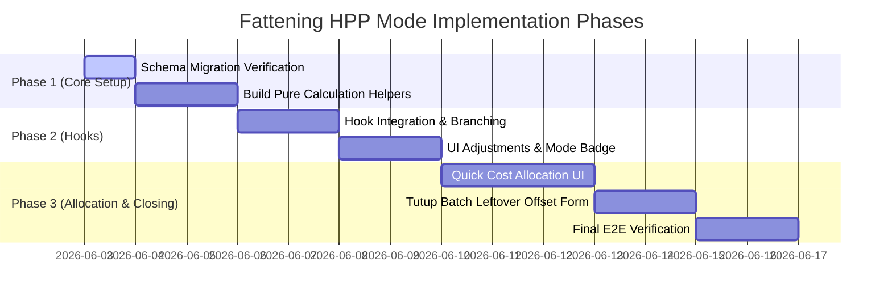

# Phase 0C — Integration Plan: HPP Mode Sederhana & Detail Penggemukan

This document outlines the detailed implementation plan for the **Mode Hitung HPP Penggemukan** (Simple/Buku Kas Batch vs. Detail/Stok & Konsumsi) feature on TernakOS. It integrates findings from Phase 0A (Frontend Audit) and Phase 0B (Database Audit) into a concrete, phased roadmap for execution.

> [!WARNING]
> **Strict Planning Mode Constraint:** No codebase changes (runtime JS/JSX source code modification) will be executed during this planning phase. The database schema migration foundation has already been successfully executed and verified on the database.

---

## 1. Actual Database Audit Findings (Phase 0B Summary)

These findings reflect the actual database status and schema verified during Phase 0B. We must build our solution around these constraints instead of inferring details from the frontend:

### A. Fattening Cycles and Tables Structure

The following tables are currently active in the production schema:

* **Batch tables:** `domba_penggemukan_batches`, `kambing_penggemukan_batches`, `sapi_penggemukan_batches`
* **Animal tables:** `domba_penggemukan_animals`, `kambing_penggemukan_animals`, `sapi_penggemukan_animals`
* **Feed log tables:** `domba_penggemukan_feed_logs`, `kambing_penggemukan_feed_logs`, `sapi_penggemukan_feed_logs`
* **Operational cost tables:** `domba_penggemukan_operational_costs`, `kambing_penggemukan_operational_costs`, `sapi_penggemukan_operational_costs`
* **Health log tables:** `domba_penggemukan_health_logs`, `kambing_penggemukan_health_logs`, `sapi_penggemukan_health_logs`
* **Sales tables:** `domba_penggemukan_sales`, `kambing_penggemukan_sales`, `sapi_penggemukan_sales`

### B. Current Batch Status Data

* **Domba:** 3 active batches
* **Kambing:** 1 active batch
* **Sapi:** 2 active batches
* *Implication:* These 6 existing active batches must default to `hpp_mode = 'detail'` to prevent retroactively modifying historical P&L margins and valuations.

### C. Current Operational Cost Data Shape

* **Domba:** 10 total rows (`batch_id is null`: 0, `batch_id is not null`: 10, active rows: 10)
  * *Domba Categories:* `listrik_air` (6 rows, total Rp320.000), `pakan` (4 rows, total Rp3.957.600)
* **Kambing:** 0 rows
* **Sapi:** 0 rows
* *Implication:* All existing operational cost rows are direct batch costs and can safely default to `allocation_role = 'direct'`. There are currently no global/unallocated costs (where `batch_id is null`) or split transactions to migrate.

### D. RLS and Tenant Settings Findings

* The `tenants` table is governed by:
  * `tenants_superadmin_all`: ALL privileges for superadmins.
  * `tenants_user_select`: SELECT-only privilege for normal tenant users.
* There is no RLS policy allowing owner or staff roles to directly write or update settings inside `tenants`.
* No existing configuration table or RPC matches tenant-wide default mode writes.
* *Implication:* We will not put business-wide default modes in the `tenants` table for the MVP. Per-batch selection will be mandatory during creation. Persisted tenant defaults are deferred to MVP+.

---

## 2. Final MVP Scope

The MVP aims to solve the usability gap for traditional/small farmers while preserving robust calculations for professional operations:

1. **Batch-Level Mode Selection:** A radio/segment selector in the `CreateBatchSheet` UI allows choosing `simple` (Buku Kas Batch) or `detail` (Stok & Konsumsi).
2. **Preservation of Detail Mode:** Pre-existing batches (where `hpp_mode` is null/undefined) automatically default to `detail` mode. The existing dynamic, weighted-average calculation logic stays in the current `useHppBatch` / `useSapiHppBatch` codebase paths and remains 100% untouched. Any extraction or refactoring of the detailed calculation logic is deferred to a later phase (out of scope for MVP).
3. **Simple HPP Mode (Cash-Basis):**
   * Formula: `Simple HPP = Modal Beli + Biaya Pakan (Cash) + Biaya Ops (Cash) + Biaya Kesehatan (Cash) - Leftover Adjustment`
   * No dynamic ekor-hari wages/overhead calculations.
   * No weighted averages of feed logs (FCR/ADG logic skipped).
4. **Adaptive HPP UI:** The HPP Panel in the sales tab dynamically adapts:
   * Displays a mode indicator badge.
   * Hides daily consumption logs and wage breakdowns in Simple Mode to reduce cognitive clutter.
5. **Quick Cost Allocation Preview & Save:**
   * Allows entering a global cost (e.g. `is_shared = true`) and splitting it across batches based on active animal headcount.
   * Shows a real-time allocation preview before submission.
6. **Tutup Batch Leftover Adjustment:**
   * Allows inputting leftover feed/medicine values at batch closure.
   * This amount is recorded as `leftover_adjustment_idr` and directly deducted from the batch's final HPP calculation.
7. **Mode Defaults:** Existing/null `hpp_mode` defaults to `detail`. The new batch creation UI preselects `simple` by default to encourage ease of use for new users, unless a persisted business default settings policy is introduced later (MVP+).
8. **Mode Edit Rule:** The HPP calculation mode cannot be changed after batch creation for MVP. Simple -> Detail mid-cycle conversions or Mode Campuran are deferred to MVP+.

---

## 3. Out-of-Scope / MVP+ Scope

1. **Persisted Tenant Default Settings:** Deferred due to RLS write restrictions on the `tenants` table.
2. **Mode Campuran / Cut-off Transition:** Converting a batch mode mid-cycle is out of scope.
3. **Auto-Pilot Feeding & Inventory:** Integration with central warehouse stock ledgers is deferred.
4. **Full Inventory Valuation:** Asset valuation of unused feed/meds is deferred.
5. **Detailed Calculation Refactoring:** Extracting existing detailed HPP formulas out of hooks to pure helpers is deferred.

---

## 4. Database Schema Migration (Executed and Verified)

The schema modifications have been successfully executed and verified on the database. No RLS rules or RPC functions were altered.

```sql
-- Migration Executed: Add columns to Fattening Batches
ALTER TABLE public.domba_penggemukan_batches 
  ADD COLUMN IF NOT EXISTS hpp_mode text NOT NULL DEFAULT 'detail',
  ADD COLUMN IF NOT EXISTS leftover_adjustment_idr numeric NOT NULL DEFAULT 0,
  ADD COLUMN IF NOT EXISTS leftover_adjustment_notes text;

ALTER TABLE public.kambing_penggemukan_batches 
  ADD COLUMN IF NOT EXISTS hpp_mode text NOT NULL DEFAULT 'detail',
  ADD COLUMN IF NOT EXISTS leftover_adjustment_idr numeric NOT NULL DEFAULT 0,
  ADD COLUMN IF NOT EXISTS leftover_adjustment_notes text;

ALTER TABLE public.sapi_penggemukan_batches 
  ADD COLUMN IF NOT EXISTS hpp_mode text NOT NULL DEFAULT 'detail',
  ADD COLUMN IF NOT EXISTS leftover_adjustment_idr numeric NOT NULL DEFAULT 0,
  ADD COLUMN IF NOT EXISTS leftover_adjustment_notes text;

-- Migration Executed: Add columns to Fattening Operational Costs
-- Note: Foreign key delete behavior is pending final migration review.
ALTER TABLE public.domba_penggemukan_operational_costs
  ADD COLUMN IF NOT EXISTS allocation_role text NOT NULL DEFAULT 'direct',
  ADD COLUMN IF NOT EXISTS allocation_parent_id uuid REFERENCES public.domba_penggemukan_operational_costs(id),
  ADD COLUMN IF NOT EXISTS allocation_method text,
  ADD COLUMN IF NOT EXISTS allocation_snapshot jsonb NOT NULL DEFAULT '{}'::jsonb;

ALTER TABLE public.kambing_penggemukan_operational_costs
  ADD COLUMN IF NOT EXISTS allocation_role text NOT NULL DEFAULT 'direct',
  ADD COLUMN IF NOT EXISTS allocation_parent_id uuid REFERENCES public.kambing_penggemukan_operational_costs(id),
  ADD COLUMN IF NOT EXISTS allocation_method text,
  ADD COLUMN IF NOT EXISTS allocation_snapshot jsonb NOT NULL DEFAULT '{}'::jsonb;

ALTER TABLE public.sapi_penggemukan_operational_costs
  ADD COLUMN IF NOT EXISTS allocation_role text NOT NULL DEFAULT 'direct',
  ADD COLUMN IF NOT EXISTS allocation_parent_id uuid REFERENCES public.sapi_penggemukan_operational_costs(id),
  ADD COLUMN IF NOT EXISTS allocation_method text,
  ADD COLUMN IF NOT EXISTS allocation_snapshot jsonb NOT NULL DEFAULT '{}'::jsonb;

-- Migration Executed: Set existing rows to retro-compatible defaults
UPDATE public.domba_penggemukan_batches SET hpp_mode = 'detail' WHERE hpp_mode IS NULL;
UPDATE public.kambing_penggemukan_batches SET hpp_mode = 'detail' WHERE hpp_mode IS NULL;
UPDATE public.sapi_penggemukan_batches SET hpp_mode = 'detail' WHERE hpp_mode IS NULL;

UPDATE public.domba_penggemukan_operational_costs SET allocation_role = 'direct' WHERE allocation_role IS NULL;
UPDATE public.kambing_penggemukan_operational_costs SET allocation_role = 'direct' WHERE allocation_role IS NULL;
UPDATE public.sapi_penggemukan_operational_costs SET allocation_role = 'direct' WHERE allocation_role IS NULL;
```

> [!IMPORTANT]
> **Delete Behavior Constraint:** The delete behavior on the `allocation_parent_id` foreign key is currently default (`RESTRICT` / `NO ACTION`). Standard `ON DELETE SET NULL` is pending review because it risks creating orphan child allocation rows that lose connection to their source expense. Soft-delete strategies, `ON DELETE RESTRICT`, or `ON DELETE CASCADE` must be evaluated when final product deletion logic is established.

---

## 5. Safe Hook/Calculation Architecture

To comply with the React Rules of Hooks, query/hook structures in `createPenggemukanHooks.js` and `useSapiPenggemukanData.js` must remain stable. We must never conditionally invoke hooks. Branching between simple and detailed calculations must happen inside pure JavaScript functions executed within a memoized block.

### Proposed Calculation Helper (`src/lib/hpp/penggemukanHppCalcs.js`)

Only `calculateSimpleHpp(data)` is introduced as a new pure helper for the MVP. The existing detailed logic remains inline inside `useHppBatch` / `useSapiHppBatch`.

```javascript
/**
 * Calculates Simple HPP (Cash Basis)
 * Returns structured HPP metrics for domba, kambing, and sapi.
 */
export function calculateSimpleHpp({ 
  animalList = [], 
  salesList = [], 
  thisBatchOpsCosts = [], 
  healthLogs = [], 
  leftoverAdjustmentIdr = 0 
}) {
  // Modal Beli (Direct sum of animal purchase price)
  const totalModalBeli = animalList.reduce((sum, a) => sum + (Number(a.purchase_price_idr) || 0), 0);

  // Biaya Pakan Cash Basis (Excluding allocation parents)
  const totalBiayaPakan = thisBatchOpsCosts
    .filter(c => c.category === 'pakan' && c.allocation_role !== 'parent')
    .reduce((sum, c) => sum + (Number(c.amount_idr) || 0), 0);

  // Biaya Ops Lain (Excluding allocation parents, pakan, and worker wages)
  const totalBiayaOps = thisBatchOpsCosts
    .filter(c => c.category !== 'pakan' && c.category !== 'gaji' && c.allocation_role !== 'parent')
    .reduce((sum, c) => sum + (Number(c.amount_idr) || 0), 0);

  // Biaya Kesehatan (Sum of treatment_cost_idr from health logs)
  const totalBiayaKesehatan = healthLogs.reduce((sum, hl) => sum + (Number(hl.treatment_cost_idr) || 0), 0);

  // Gross HPP calculation
  const grossHpp = totalModalBeli + totalBiayaPakan + totalBiayaOps + totalBiayaKesehatan;

  // Deduct Leftover Adjustment
  const totalHpp = Math.max(0, grossHpp - Number(leftoverAdjustmentIdr));

  // Count active and sold animals (excl. dead/afkir)
  const terjualCount = animalList.filter(a => a.status === 'sold').length;
  const aktifCount = animalList.filter(a => a.status === 'active').length;
  const produksiCount = aktifCount + terjualCount;

  // Revenue calculation
  const totalPendapatan = salesList.reduce((sum, s) => sum + (Number(s.total_revenue_idr) || 0), 0);

  return {
    totalModalBeli,
    totalBiayaPakan,
    totalBiayaOpsLain: totalBiayaOps,
    totalBiayaGajiOverhead: 0, // Wages are not dynamically calculated per batch in simple mode
    totalBiayaKesehatan,
    totalHpp,
    hppPerEkor: produksiCount > 0 ? totalHpp / produksiCount : 0,
    bepPerEkor: (produksiCount > 0 ? totalHpp / produksiCount : 0) * 1.20,
    totalPendapatan,
    profitLoss: totalPendapatan - totalHpp,
    isSimpleMode: true
  };
}
```

---

## 6. UI/UX Flow Modifications

### A. Create Batch Mode Selector

* **Location:** `CreateBatchSheet` inside `PenggemukanBatch.jsx`.
* **Behavior:** A segment control / radio option displayed during batch creation.
* **Preselection:** Preselects `simple` by default to encourage ease of use.
* **Fallback:** If not specified or null, defaults to `'detail'`.

### B. HPP Panel Mode Badge

* **Location:** `HppPanel` header inside `PenggemukanPenjualan.jsx`.
* **Behavior:** A subtle badge styling matching the theme:
  * `simple` mode -> Displays "MODE SEDERHANA" in emerald/green theme (`text-emerald-400 bg-emerald-500/10 border-emerald-500/20`).
  * `detail` mode -> Displays "MODE DETAIL" in violet/purple theme (`text-violet-400 bg-violet-500/10 border-violet-500/20`).

### C. Simple HPP Breakdown UI

* **Location:** `HppPanel` inside `PenggemukanPenjualan.jsx`.
* **Behavior:** Hides FCR, ADG, feed weight averages, daily active animal counts, and dynamic wages breakdown. Renders only direct row items:
  * Modal Beli Ternak.
  * Biaya Pakan (Cash).
  * Biaya Operasional (Cash).
  * Biaya Kesehatan (Cash).
  * Penyesuaian Sisa Pakan/Obat (Kredit).

### D. Quick Allocation Split Preview

* **Location:** `handleAddCost` modal / `BiayaTab` inside `PenggemukanPakan.jsx`.
* **Behavior:** When checking "Biaya Bersama" (is_shared), a real-time list appears showing batch targets, active headcounts, and calculated allocation shares.

### E. Tutup Batch Leftover Adjustment Form

* **Location:** `CloseBatchWizard` inside `PenggemukanBatch.jsx`.
* **Behavior:** Step 2 of the close batch wizard includes inputs for `leftover_adjustment_idr` (Rupiah amount) and notes, which are passed to the close batch call.

---

## 7. Data Rules & Boundaries (Anti Double-Counting)

To prevent inflating cash outflows or HPP calculations, we establish strict reporting boundaries based on `allocation_role`:

```
Operational Cost Role Definitions:
- direct: Cost mapped specifically to 1 batch (e.g. batch-specific feed purchase).
- parent: Global/shared transaction. Represents the raw cash outflow.
- child : Allocated split share mapped to a batch (derived from parent).
```

### A. Quick Allocation Atomic Save Rules

To ensure consistency, Quick Allocation split transactions must follow a strict save sequence:
1.  **Create parent row first** to obtain a valid `id` (UUID).
2.  **Create child rows after** referencing the parent ID.
3.  **Consistency Safety:** If any child row insertion fails, the parent row must not be left orphaned in the database. The system must implement a rollback strategy:
    *   *Frontend Strategy (MVP):* The frontend MVP uses a compensating rollback strategy by updating `is_deleted = true` for the parent row and any successfully created child rows if a later child insert fails. This is not a true database transaction; a transaction-safe RPC is deferred to MVP+. Hard DELETE must not be used because normal tenant users do not have DELETE permission on operational cost tables.
    *   *Database RPC Strategy (MVP+ / Optional):* A transaction-safe RPC function (e.g., `save_allocated_cost`) may be considered later to handle parent/child inserts atomically inside a Postgres transaction block.

### B. Reporting Guardrail Routing

| Report Type                    | Included Roles / Rules                                                                                                                                           | Excluded Roles | Rationale                                                                                                                 |
| :----------------------------- | :--------------------------------------------------------------------------------------------------------------------------------------------------------------- | :------------- | :------------------------------------------------------------------------------------------------------------------------ |
| **HPP Batch Reports**          | Rows where `batch_id = target batch id` and `allocation_role` is in (`'direct'`, `'child'`).                                                                     | `'parent'`     | Counts direct costs and allocated batch shares. Excludes the parent transaction to avoid double counting the split.       |
| **Global Cash Reports**        | Rows where `allocation_role` is in (`'direct'`, `'parent'`).                                                                                                     | `'child'`      | Represents actual cash outlays. Excludes child allocations as they represent accounting divisions, not new cash outflows. |
| **Consolidated Reports**       | Direct filtering by role to exclude child rows when listing global cash or exclude parent rows when listing batch-level reports.                                 | N/A            | Must never sum `parent` and `child` roles together.                                                                       |

---

## 8. Edge Cases & Mitigations

| Edge Case                            | Risk                                                       | Mitigation                                                                                                                                                                 |
| :----------------------------------- | :--------------------------------------------------------- | :------------------------------------------------------------------------------------------------------------------------------------------------------------------------- |
| **Direct Cost vs. Child Cost** | Double counting in P&L reporting.                          | Explicitly enforce `allocation_role` enum values (`direct`, `parent`, `child`) instead of relying on nullable parent ID check.                                     |
| **Batch Closed**               | UI permits editing of costs or mode changing post-closure. | Once a batch status is `'closed'`, block mode selector changes. Set operational cost inputs for that batch to read-only.                                                 |
| **Dead / Afkir Animals**       | Disproportionate HPP per head.                             | In simple mode, dead animals are excluded from `produksiCount` (divisor). Their purchase cost is absorbed by the remaining active/sold cohort. FCR/ADG logic is skipped. |
| **No Operational Costs**       | Division by zero or null calculations.                     | Calculation helpers fallback cleanly to `0` and treat empty arrays safely.                                                                                               |
| **No Purchase Price Input**    | HPP calculation returns artificially low values.           | Display warning alert banner: "X ekor belum memiliki harga beli. HPP mungkin tidak akurat."                                                                                |
| **No Sales Yet**               | Net Profit/Loss logic crashes or fails.                    | Profit/Loss calculations treat `totalPendapatan = 0` and display negative profit (loss) correctly.                                                                       |

---

## 9. File-by-File Implementation Map

### Hooks & Calculations

1. **`src/lib/hpp/penggemukanHppCalcs.js` [NEW]**
   * Contains pure helper `calculateSimpleHpp(data)`.
2. **`src/lib/hooks/createPenggemukanHooks.js` [MODIFY]**
   * Retrieve `hpp_mode`, `leftover_adjustment_idr`, and `leftover_adjustment_notes` in `useBatchRecord` / `useHppBatch`.
   * Perform calculations branching inside `useHppBatch`'s `useMemo` block using the new pure helper function.
3. **`src/lib/hooks/useSapiPenggemukanData.js` [MODIFY]**
   * Update `useSapiHppBatch` to fetch batch parameters and select simple vs detailed math inside `useMemo`.

### UI & Forms

4. **`src/dashboard/peternak/_shared/components/penggemukan/PenggemukanBatch.jsx` [MODIFY]**
   * Add mode radio segment to `CreateBatchSheet` form.
   * Add leftover adjustment fields (`leftover_adjustment_idr` and notes) inside `CloseBatchWizard` (Step 2/rekap).
5. **`src/dashboard/peternak/_shared/components/penggemukan/PenggemukanPenjualan.jsx` [MODIFY]**
   * Add `<HppModeBadge />` component.
   * Conditionally render simplified metrics, hiding dynamic overhead cards when batch is in Simple Mode.
6. **`src/dashboard/peternak/_shared/components/penggemukan/PenggemukanPakan.jsx` [MODIFY]**
   * Create real-time split preview UI under "Biaya Bersama" checkbox.
   * Pass `allocation_role`, `allocation_parent_id`, and `allocation_method` in the payload during `handleAddCost` submission.

---

## 10. Testing Checklist

- [ ] **Retro-compatibility Check:** Open active batches (Domba: 3, Kambing: 1, Sapi: 2) and verify they load in Detail Mode and display historical metrics correctly.
- [ ] **Hook Stability Validation:** Verify console runs with no React Rules of Hooks lint warnings.
- [ ] **Closed Batch Protection:** Try to add a cost to a closed batch cycle; verify UI locks inputs.
- [ ] **Math Consistency Check:** Confirm that for a simple batch: `HPP = Modal Beli + Pakan (Cash) + Ops (Cash) + Kesehatan (Cash) - Leftover`.
- [ ] **Double-counting Prevention:** Query operational costs and verify that `child` rows are omitted from global cash reports.

---

## 11. Risks & Mitigations

* **Risk:** Performance latency when rendering batch list due to client-side HPP compilation.
  * *Mitigation:* Keep calculated fields cached using React Query `staleTime: 5 * 60 * 1000` (5 minutes) and ensure `useMemo` dependency arrays are minimal.
* **Risk:** Accidental manual mode modification mid-cycle.
  * *Mitigation:* Disable mode selector input once batch creation transaction has completed. Mode is read-only for active and closed batches.

---

## 12. Final Recommended Implementation Phases



---

## 13. Verification and Safety Declarations

* **No source or runtime code changed** in this workspace.
* **The database migration columns, indexes, and constraints have been verified** as successfully executed.
* **No RLS policies or RPC functions** were changed.
* **Existing Detailed HPP logic remains 100% preserved** as the default fallback for existing or undefined batch records.
