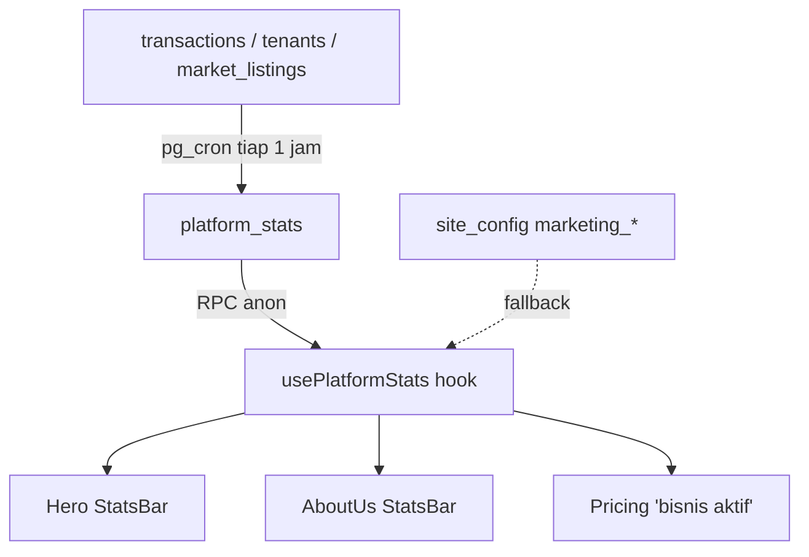

I have created the following plan after thorough exploration and analysis of the codebase. Follow the below plan verbatim. Trust the files and references. Do not re-verify what's written in the plan. Explore only when absolutely necessary. First implement all the proposed file changes and then I'll review all the changes together at the end.

## Verifikasi Audit (cocokkan dengan kode internal)

Audit sebagian besar **valid**, tapi ada beberapa nuansa setelah saya cek source aslinya:

| # | Klaim Audit | Status di Repo | Catatan |
|---|---|---|---|
| 1 | Counter inkonsisten 0 vs 500+ | ✅ Benar | `file:src/sections/StatsBar.jsx` punya fallback `500/50rb+/Rp 250M+`, tapi memakai `cfg.stats_users` dari `useSiteConfig`. Jika admin mengisi `"0"` (truthy string), counter render `0`. `file:src/sections/Pricing.jsx` hardcode `+500 bisnis aktif` (line 368, 501, 548). `file:src/pages/AboutUs.jsx` punya StatsBar terpisah lagi → 3 sumber berbeda. |
| 2 | Hero: `Lebih Cepat.Lebih Cepat.Lebih Rapi.` | ✅ Benar | `file:src/sections/Hero.jsx` line 162 & 180 — baris "Lebih Cepat." dirender 2× (sebagai base + shimmer overlay). Tidak ada "Lebih Akurat.". |
| 3 | Market kosong (0 listing/stok/dicari) | ✅ Benar | `file:src/pages/MarketPublic.jsx` line 231-233 menghitung dari `useMarketListings` real. Tidak ada seed data, tidak ada listing publik tanpa register (CTA `/register`). |
| 4 | Harga Pasar bagus tapi belum lead magnet | ✅ Benar | `file:src/pages/HargaPasarPublic.jsx` sudah hybrid (scraper + RPC platform), sudah punya province slug & SEO schema, **belum ada** kalkulator margin, confidence score, WA alert, atau halaman SEO per-provinsi (`/harga-ayam-broiler/:province`). |
| 5 | Multi-vertikal terlalu lebar | ⚠️ Sebagian | `file:src/sections/Pricing.jsx` sudah punya role tabs (broker/peternak/rpa). Yang belum: hero CTA segmentation. |
| 6 | Onboarding wizard | ❌ Tidak ada | `file:src/dashboard/peternak/broiler/SetupFarm.jsx` ada (farm-only), tapi tidak ada first-login wizard role+commodity+import. |
| 7 | Excel import | ❌ Tidak ada | Tidak ditemukan parser Excel di `src/lib/`. |
| 8 | Audit log | ⚠️ Sebagian | `file:src/dashboard/admin/AdminActivity.jsx` ada (admin view), tapi belum ada tabel audit untuk delete/update transaksi/piutang/role-change. |
| 9 | Soft-delete / Recycle bin | ❌ Tidak ada | Tidak terlihat di schema. |
| 10 | Role permission templates | ⚠️ Sebagian | `file:src/lib/auth/business-roles.js` ada, tapi belum granular per modul (Finance/Operator Kandang/Driver). |
| 11 | WhatsApp notifications | ❌ Tidak ada | Hanya `wa.me` deep-link di `MarketPublic`. Tidak ada outbound API. |
| 12 | Fitur peternak (FCR, IP, deplesi, dll) | ✅ Sudah ada | `file:src/dashboard/peternak/broiler/` (Siklus, Pakan, InputHarian, LaporanSiklus, DailyTask, Vaksinasi). Audit "Priority 2" sebagian besar **sudah jalan**. |
| 13 | platform_stats single source | ❌ Tidak ada | Hanya `useSiteConfig` (manual key-value). |

**Kesimpulan:** Audit valid. Yang menjadi prioritas nyata berdasarkan repo: **(a) konsolidasi counter & fix copy hero (cepat),** **(b) marketplace seeding + listing publik,** **(c) Harga Pasar lead-magnet,** **(d) onboarding wizard + Excel import,** **(e) WA notifier + audit log + soft delete.**

---

## Pendekatan

Saya susun roadmap 4 minggu yang **selaras dengan struktur folder & stack existing** (React + Vite + Supabase + RLS + react-query hooks di `src/lib/hooks/`, schema generator di `supabase/generate_sqls.py`). Tidak menambah library baru kecuali wajib (`xlsx` untuk import Excel). Setiap perubahan re-use komponen yang sudah ada (`Navbar`, `SEO`, `useMarket`, `usePricingConfig`).

---

## Rencana Implementasi

### MINGGU 1 — Trust & Conversion Cleanup (Quick Wins)

**1.1 Single source of truth untuk counter**
- Tambah migrasi baru via `file:supabase/generate_sqls.py` flow → buat tabel `platform_stats` (kolom: `id`, `active_businesses int`, `total_transactions int`, `transaction_volume numeric`, `market_listings int`, `updated_at timestamptz`) di `file:supabase/04_tables.sql`.
- Buat materialized view atau scheduled function (`pg_cron`) yang mengisi `platform_stats` dari tabel `tenants`, `transactions`, `market_listings` — letakkan di `file:supabase/08_functions.sql`.
- Grant SELECT untuk `anon` di `file:supabase/19_public_anon_access.sql`.
- Buat hook baru `usePlatformStats` di `src/lib/hooks/usePlatformStats.js` (mirror pola `useSiteConfig`).
- Refactor `file:src/sections/StatsBar.jsx`: ganti fallback hardcoded → consume `usePlatformStats`. Bila value `null/0` → render copy `"Data sedang diperbarui"` bukan `0+`.
- Refactor `file:src/pages/AboutUs.jsx` (lines 161-190 stats bar) untuk pakai hook yang sama.
- Refactor `file:src/sections/Pricing.jsx` lines 368, 501, 548 → ambil dari `usePlatformStats().active_businesses`.
- Pisahkan **marketing claim** (admin-editable di `site_config`, key `marketing_*`) dari **live stats** (`platform_stats`); StatsBar boleh prioritaskan live, fallback marketing.

**1.2 Fix copy hero**
- Di `file:src/sections/Hero.jsx` line 162 & 180: ganti string kedua dari `"Lebih Cepat."` → `"Lebih Akurat."` (di base text dan di shimmer overlay text). Pertahankan struktur 3 baris: Cepat / Akurat / Rapi.

**1.3 Hero CTA segmentation**
- Tambah selector role di hero (`Saya Broker | Saya Peternak | Saya RPA`) — gunakan state untuk men-deeplink CTA `/register?role=broker`. Pricing sudah dukung `activeRole`; kirim role lewat URL param sehingga `Pricing.jsx` auto-select tab.
- Update `file:src/sections/Pricing.jsx` — baca `?role=` query param di mount.

**1.4 Trust badges & Security page**
- Tambah `src/pages/SecurityPage.jsx` (re-use isi `file:src/pages/PrivacyPage.jsx`, restruktur jadi: RLS isolation, daily backup, OAuth scope minimal, PDP).
- Tambah link "Security" di `Footer` component.
- Tambahkan trust badge row di `file:src/sections/Pricing.jsx` di atas FAQ.

**Diagram alur counter baru:**

---

### MINGGU 2 — Onboarding & Excel Import

**2.1 First-login wizard**
- Buat `src/onboarding/OnboardingWizard.jsx` dengan 4 step: Role → Commodity → First Kandang/Customer → Import or Sample Data.
- Tambah kolom `onboarding_completed_at timestamptz` di tabel `tenants` (`file:supabase/04_tables.sql`).
- Guard: setelah login, jika `onboarding_completed_at IS NULL` redirect ke `/onboarding`.
- Re-use `file:src/dashboard/peternak/broiler/SetupFarm.jsx` sebagai sub-step "First Kandang" (extract jadi shareable component).
- Tambah progress bar (% selesai) dan opsi "Lewati & lihat demo".

**2.2 Demo data mode**
- Buat function SQL `seed_demo_data(tenant_id uuid)` di `file:supabase/08_functions.sql` yang mengisi 1 kandang, 1 siklus contoh, 5 transaksi, 2 piutang, semua diberi flag `is_demo boolean`.
- Tombol "Lihat contoh dashboard Pak Budi" memanggil RPC ini.
- Tambah banner persisten "Mode Demo — Hapus data contoh" di dashboard.

**2.3 Excel import MVP**
- Tambah dependency `xlsx` (cek dulu `package.json` apakah ada SheetJS).
- Komponen `src/onboarding/ExcelImporter.jsx`:
  - Upload → parse sheet pertama
  - Mapping screen (auto-detect kolom: tanggal, kandang, bobot, pakan, mortalitas, harga_beli, harga_jual, piutang)
  - Preview tabel + validation warning
  - Insert batch via Supabase, simpan `import_batch_id` untuk rollback
- RPC `rollback_import(batch_id uuid)`.

**2.4 Empty state CTA**
- Tambahkan empty state pada `file:src/dashboard/peternak/broiler/Beranda.jsx` & broker dashboard listing pages: "Belum ada transaksi → [Tambah Pertama]" dengan deep-link ke form.

---

### MINGGU 3 — Marketplace & Harga Pasar Flywheel

**3.1 Public listing creation (no login, WA verification)**
- Buat halaman `src/pages/MarketCreatePublic.jsx`.
- Tambah tabel `public_market_drafts` (server-side OTP via WA gateway sederhana — bisa gunakan link `wa.me` + token saat MVP).
- Setelah verifikasi, masukkan ke `market_listings` dengan flag `source='public_unauth'`.
- Tambah field `expires_at` (default 14 hari) di tabel listing; filter `useMarketListings` agar `expires_at > now()`.

**3.2 Filter province/city + sample seed**
- Tambah dropdown provinsi & kota di `file:src/pages/MarketPublic.jsx` (re-use list provinsi dari `HargaPasarPublic`).
- Insert ~15 sample listing berlabel `is_sample=true`, render dengan badge "Contoh" sehingga jelas; auto-hide ketika real listing > N.

**3.3 "Kandang Siap Panen → Broadcast" (one implementation paling penting per audit)**
- Tambah field `predicted_harvest_date`, `ready_for_broadcast bool` di tabel siklus.
- RPC `broadcast_kandang_to_brokers(cycle_id)` yang:
  1. Buat row di `market_listings` (type `stok_ayam`, source `auto_kandang`).
  2. Insert antrean WA notification untuk broker pada provinsi yang sama.
- UI tombol "Broadcast ke Broker Sekitar" di `file:src/dashboard/peternak/broiler/Siklus.jsx`.

**3.4 Harga Pasar lead magnet**
- Di `file:src/pages/HargaPasarPublic.jsx`: tambah section **Margin Simulator** (input harga beli, transport, susut %, harga jual; output margin/kg) — pure client-side.
- Tambah **Confidence Score** badge per provinsi (low/medium/high) berdasarkan jumlah transaksi 7-hari (RPC sudah ada, tinggal expose count).
- Tambah halaman dinamis `src/pages/HargaPasarProvincePage.jsx` di route `/harga-ayam-broiler/:province` — re-use komponen yang sudah ada, generate sitemap.xml entry per provinsi.
- Form opt-in WA alert harian (simpan ke tabel `wa_subscriptions`).

**3.5 Public lead-magnet calculators**
- Halaman baru: `/kalkulator-fcr`, `/kalkulator-ip-broiler`, `/kalkulator-margin-broker-ayam`, `/template-excel-kandang`. Semua client-side, CTA bawah → `/register`. Daftarkan di `file:src/App.jsx`.

---

### MINGGU 4 — Retention & Trust Layer

**4.1 Piutang reminder + WA notifier**
- Tabel `wa_outbox` (id, to_number, template, payload jsonb, status, scheduled_at).
- Edge Function Supabase `send-wa-outbox` (trigger cron tiap 5 menit) memanggil WA gateway (Fonnte/Wablas — pilih satu, simpan token di env).
- Trigger SQL: ketika piutang `due_date - now() < 1 day` → enqueue.

**4.2 Audit log untuk aksi sensitif**
- Tabel `audit_logs` (actor_id, tenant_id, entity, entity_id, action, before jsonb, after jsonb, created_at).
- Trigger `AFTER UPDATE/DELETE` pada `transactions`, `piutang`, `payments`, `business_members`, `subscriptions` → tulis ke `audit_logs`.
- Halaman view di `file:src/dashboard/admin/AdminActivity.jsx` (extend existing) + tab di Business plan settings.

**4.3 Soft delete + Recycle Bin**
- Tambah kolom `deleted_at timestamptz` di tabel transaksi & piutang (tabel high-impact saja).
- Update RLS di `file:supabase/14_policies.sql` untuk default exclude `deleted_at IS NOT NULL`.
- View `recycle_bin` per tenant + UI restore/purge (purge >30 hari otomatis).

**4.4 Role-based permission templates**
- Extend `file:src/lib/auth/business-roles.js`: tambah preset `Finance`, `Operator Kandang`, `Driver`, `Viewer` dengan permission matrix granular per modul.
- UI assignment di settings team management.

**4.5 Data quality scoring**
- Saat input pakan/mortalitas/harga, tambahkan validator (FCR < 1.0 atau > 3.0 → warning; harga jual < 70% harga pasar → warning). Implementasi sebagai utility `src/lib/validators/dataQuality.js`, panggil di form submission peternak & broker.

---

## Tabel Prioritas Eksekusi

| Sprint | Effort | Impact | Risiko |
|---|---|---|---|
| 1.1 platform_stats | S | Tinggi (trust) | Rendah |
| 1.2 fix hero copy | XS | Sedang | None |
| 1.3 CTA segmentation | S | Sedang | Rendah |
| 2.1 onboarding wizard | M | Tinggi (activation) | Sedang (refactor SetupFarm) |
| 2.3 Excel import | M | Tinggi (acquisition) | Sedang (parser edge cases) |
| 3.3 Broadcast Kandang→Broker | M | **Sangat tinggi (moat)** | Sedang (perlu WA) |
| 3.4 Harga Pasar simulator+SEO | S | Tinggi (SEO traffic) | Rendah |
| 4.1 WA outbox | M | Tinggi (retention) | Tinggi (vendor + cost) |
| 4.2 audit log | S | Sedang | Rendah |
| 4.3 soft delete | S | Sedang | Sedang (RLS rewrite) |

## File yang Disentuh (rangkuman)

**Modifikasi:**
- `file:src/sections/Hero.jsx`, `file:src/sections/StatsBar.jsx`, `file:src/sections/Pricing.jsx`
- `file:src/pages/AboutUs.jsx`, `file:src/pages/MarketPublic.jsx`, `file:src/pages/HargaPasarPublic.jsx`
- `file:src/dashboard/peternak/broiler/Siklus.jsx`, `file:src/dashboard/peternak/broiler/Beranda.jsx`
- `file:src/dashboard/admin/AdminActivity.jsx`
- `file:src/lib/auth/business-roles.js`
- `file:src/App.jsx` (routing baru)
- `file:supabase/04_tables.sql`, `file:supabase/08_functions.sql`, `file:supabase/12_triggers.sql`, `file:supabase/14_policies.sql`, `file:supabase/19_public_anon_access.sql`

**Baru:**
- `src/lib/hooks/usePlatformStats.js`
- `src/onboarding/OnboardingWizard.jsx`, `src/onboarding/ExcelImporter.jsx`
- `src/pages/SecurityPage.jsx`, `src/pages/MarketCreatePublic.jsx`, `src/pages/HargaPasarProvincePage.jsx`
- `src/pages/calculators/{FCR,IP,Margin,Template}.jsx`
- `src/lib/validators/dataQuality.js`
- Supabase Edge Function `send-wa-outbox`