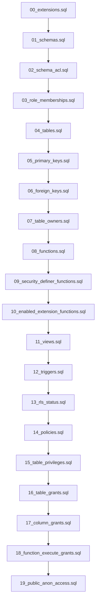

## Observasi Kunci

- Folder `supabase/` saat ini hanya berisi 3 file SQL (`00_extensions.sql`, `01_schemas.sql`, `02_tables.sql`) yang hanya mencakup sebagian dari snapshot database (extensions, schemas, dan sebagian besar tables + FK di akhir `02_tables.sql`).
- Terdapat 20 file `.txt` snapshot terbaru dari Supabase live database (COLUMN GRANTS, EXTENSIONS, FOREIGN KEYS, FUNCTIONS, POLICIES, PRIMARY KEYS, dst.) yang belum sepenuhnya direkonsiliasi ke file `.sql`.
- `supabase/README.md` sudah menetapkan pakem keamanan (RLS `is_tenant_member()`, `SECURITY DEFINER` + `search_path`, schema `rpc`, dll.) yang harus dihormati saat regenerasi.
- File `02_tables.sql` saat ini sudah memuat banyak FK di bagian akhir (baris 3230–3524) — ini perlu dipisah agar terorganisir dan tidak duplikat.

## Pendekatan

Saya akan menyusun ulang folder `supabase/` menjadi serangkaian file SQL bernomor, satu file per kategori snapshot, sehingga AI/developer cukup membaca file `.sql` (bukan `.txt`). Setiap file `.sql` di-regenerate **hanya dari isi file `.txt` terbaru** yang bersesuaian, dengan urutan eksekusi yang aman secara dependensi (extensions → schemas → roles → tables → constraints → views → functions → triggers → policies → grants). File `.txt` tetap dipertahankan sebagai sumber referensi mentah, dan `02_tables.sql` lama dipangkas (FK dipindah keluar) atau diganti penuh.

## Diagram Urutan Eksekusi SQL

## Instruksi Implementasi

### Langkah 0 — Simpan plan ini ke file di workspace
Sebelum melakukan modifikasi apa pun pada folder `supabase/`, executor **WAJIB** menyimpan seluruh isi plan ini secara verbatim ke file `supabase/REGENERATION_PLAN.md` (buat file baru jika belum ada, overwrite jika sudah ada). Tujuannya:

- Memberi referensi tunggal yang stabil sehingga proses dapat dilanjutkan/diaudit kapan saja tanpa bergantung pada riwayat chat.
- Menghindari masalah truncation pada tampilan chat untuk plan yang panjang.

Isi file harus mencakup seluruh seksi: **Observasi Kunci**, **Pendekatan**, **Diagram Urutan Eksekusi SQL**, **Instruksi Implementasi (Langkah 0–6)**, **Catatan Penting**, dan **Eksekusi**. Setelah file tersimpan, lanjut ke Langkah 1.

### Langkah 1 — Tetapkan struktur file SQL target
Susun ulang folder `supabase/` menjadi file-file berikut (satu file `.sql` per file `.txt`), dengan prefix angka untuk menjamin urutan eksekusi:

| # | File SQL Baru | Sumber `.txt` |
|---|---|---|
| 00 | `00_extensions.sql` *(regenerate)* | `Supabase EXTENSIONS.txt` |
| 01 | `01_schemas.sql` *(regenerate)* | `Supabase SCHEMAS.txt` |
| 02 | `02_schema_acl.sql` *(baru)* | `Supabase SCHEMA ACL.txt` |
| 03 | `03_role_memberships.sql` *(baru)* | `Supabase ROLE MEMBERSHIPS.txt` |
| 04 | `04_tables.sql` *(replace `02_tables.sql`)* | `Supabase TABLES + RLS STATUS.txt` + `Supabase TABLE COLUMNS.txt` |
| 05 | `05_primary_keys.sql` *(baru)* | `Supabase PRIMARY KEYS.txt` |
| 06 | `06_foreign_keys.sql` *(baru)* | `Supabase FOREIGN KEYS.txt` |
| 07 | `07_table_owners.sql` *(baru)* | `Supabase TABLE OWNERS.txt` |
| 08 | `08_functions.sql` *(baru)* | `Supabase FUNCTIONS.txt` |
| 09 | `09_security_definer_functions.sql` *(baru)* | `Supabase SECURITY DEFINER FUNCTIONS.txt` |
| 10 | `10_enabled_extension_functions.sql` *(baru)* | `Supabase ENABLED EXTENSION FUNCTIONS.txt` |
| 11 | `11_views.sql` *(baru)* | `Supabase VIEWS.txt` |
| 12 | `12_triggers.sql` *(baru)* | `Supabase TRIGGERS.txt` |
| 13 | `13_rls_status.sql` *(baru)* | bagian RLS dari `Supabase TABLES + RLS STATUS.txt` |
| 14 | `14_policies.sql` *(baru)* | `Supabase POLICIES.txt` |
| 15 | `15_table_privileges.sql` *(baru)* | `Supabase TABLE PRIVILEGES.txt` |
| 16 | `16_table_grants.sql` *(baru)* | `Supabase TABLE GRANTS.txt` |
| 17 | `17_column_grants.sql` *(baru)* | `Supabase COLUMN GRANTS.txt` |
| 18 | `18_function_execute_grants.sql` *(baru)* | `Supabase FUNCTION EXECUTE GRANTS.txt` |
| 19 | `19_public_anon_access.sql` *(baru)* | `Supabase PUBLIC AND ANON ACCESS.txt` |

> Catatan: file `02_tables.sql` lama harus dihapus/diganti karena namanya bertabrakan dengan skema penomoran baru (`02_schema_acl.sql`). FK di bagian akhirnya (baris 3230–3524) akan dipindah ke `06_foreign_keys.sql`.

### Langkah 2 — Aturan regenerasi tiap file
Untuk setiap file `.sql` yang dibuat:

1. **Header standar** di baris atas:
   - Komentar `-- <nama_file>.sql`
   - `-- Generated from <nama .txt sumber>`
   - `-- Last sync: <tanggal>`
   - `-- DO NOT EDIT MANUALLY — regenerate from snapshot .txt`
2. **Idempotensi**: gunakan `IF NOT EXISTS` / `CREATE OR REPLACE` / `DROP ... IF EXISTS` jika memungkinkan, sehingga file dapat dieksekusi ulang tanpa error.
3. **Quoting konsisten**: bungkus identifier dengan tanda kutip ganda (`"schema"."table"`) seperti gaya `00_extensions.sql` dan `01_schemas.sql` yang sudah ada.
4. **Schema-qualified**: setiap object harus prefix schema-nya (`public.`, `auth.`, `internal.`, `rpc.`, `storage.`, `vault.`, `cron.`, `extensions.`).
5. **Tidak menyalin data Supabase-managed**: lewati object yang dimiliki ekstensi/Supabase internal (mis. `pg_stat_statements`, `auth.users` sistem) — biarkan ditangani Supabase, kecuali snapshot `.txt` memang menampilkan kolom tambahan custom.

### Langkah 3 — Detail per file

- **`00_extensions.sql`**: regenerate persis dari `Supabase EXTENSIONS.txt` (versi dapat berubah). Pertahankan komentar `plpgsql` built-in.
- **`01_schemas.sql`**: regenerate dari `Supabase SCHEMAS.txt` + bagian owner. Pastikan urutan: `CREATE SCHEMA` dulu, lalu `ALTER SCHEMA ... OWNER TO`.
- **`02_schema_acl.sql`**: berisi `GRANT USAGE` / `GRANT CREATE` per schema per role sesuai `Supabase SCHEMA ACL.txt`.
- **`03_role_memberships.sql`**: gunakan `GRANT <role> TO <member>;` sesuai `Supabase ROLE MEMBERSHIPS.txt`. Bungkus dengan `DO $ ... EXCEPTION WHEN undefined_object THEN NULL; END $;` agar aman jika role belum ada.
- **`04_tables.sql`**: 
  - Susun `CREATE TABLE IF NOT EXISTS` per schema, urut alfabetis dalam tiap schema (public dulu, lalu auth/storage/vault/cron/internal/rpc).
  - Definisi kolom diambil dari `Supabase TABLE COLUMNS.txt` (nama, tipe, nullable, default, identity).
  - Hanya `CREATE TABLE` + `ALTER TABLE ... ADD COLUMN` jika ada perubahan; **tidak** memuat PK/FK (pisah ke file 05/06).
  - Pertahankan komentar pengelompokan domain (CORE, AI, POULTRY, DOMBA, KAMBING, SAPI, SEMBAKO, RPA, dst.) seperti `02_tables.sql` lama agar mudah dinavigasi.
- **`05_primary_keys.sql`**: `ALTER TABLE ... ADD CONSTRAINT <pk_name> PRIMARY KEY (...)` dari `Supabase PRIMARY KEYS.txt`.
- **`06_foreign_keys.sql`**: 
  - Pindahkan semua FK dari ekor `02_tables.sql` lama ke sini, lalu rekonsiliasi/replace penuh dengan `Supabase FOREIGN KEYS.txt`.
  - Format: `ALTER TABLE ... ADD CONSTRAINT <fk_name> FOREIGN KEY (...) REFERENCES ... ON DELETE ... ON UPDATE ...`.
- **`07_table_owners.sql`**: `ALTER TABLE <schema>.<table> OWNER TO <role>;` dari `Supabase TABLE OWNERS.txt`.
- **`08_functions.sql`**: 
  - Untuk tiap fungsi di `Supabase FUNCTIONS.txt`, gunakan `CREATE OR REPLACE FUNCTION ...` lengkap dengan `LANGUAGE`, `VOLATILITY`, `SECURITY INVOKER/DEFINER`, dan **`SET search_path = ...`** wajib (sesuai aturan `README.md` Rule 1).
  - Kelompokkan per schema (`public`, `internal`, `rpc`, `auth`, `storage`).
- **`09_security_definer_functions.sql`**: 
  - Berisi **hanya** fungsi `SECURITY DEFINER` dari `Supabase SECURITY DEFINER FUNCTIONS.txt` sebagai dokumentasi/audit. 
  - Jika definisi sudah ada di `08_functions.sql`, file ini cukup berupa komentar inventaris + `ALTER FUNCTION ... SECURITY DEFINER SET search_path = ...` untuk menegaskan hardening.
- **`10_enabled_extension_functions.sql`**: berisi komentar daftar fungsi yang disediakan oleh extensions (read-only inventory dari `Supabase ENABLED EXTENSION FUNCTIONS.txt`). Tidak ada `CREATE FUNCTION` di sini—hanya catatan.
- **`11_views.sql`**: `CREATE OR REPLACE VIEW <schema>.<name> AS ...` dari `Supabase VIEWS.txt`. Set `ALTER VIEW ... OWNER TO ...` jika tertera.
- **`12_triggers.sql`**: `DROP TRIGGER IF EXISTS ...; CREATE TRIGGER ...` dari `Supabase TRIGGERS.txt`. Pastikan fungsi trigger sudah didefinisikan di `08_functions.sql`.
- **`13_rls_status.sql`**: untuk tiap tabel di `Supabase TABLES + RLS STATUS.txt`, emit `ALTER TABLE ... ENABLE ROW LEVEL SECURITY;` dan `ALTER TABLE ... FORCE ROW LEVEL SECURITY;` sesuai status snapshot.
- **`14_policies.sql`**: 
  - `DROP POLICY IF EXISTS ... ON ...; CREATE POLICY ... ON ... FOR ... USING (...) WITH CHECK (...);` dari `Supabase POLICIES.txt`.
  - Validasi pakem dari `README.md`: pastikan tidak ada policy memakai `my_tenant_id()` / `is_my_tenant()`. Jika ditemukan di snapshot, tetap salin apa adanya (snapshot adalah ground truth) dan tambahkan komentar `-- TODO: migrate to is_tenant_member()` di atas policy tersebut.
- **`15_table_privileges.sql`**: meta privileges (mis. `ALTER DEFAULT PRIVILEGES`) dari `Supabase TABLE PRIVILEGES.txt` jika berbeda dari per-table grants.
- **`16_table_grants.sql`**: `GRANT <priv> ON TABLE ... TO <role>;` dari `Supabase TABLE GRANTS.txt`.
- **`17_column_grants.sql`**: `GRANT <priv> (col1, col2) ON ... TO <role>;` dari `Supabase COLUMN GRANTS.txt`.
- **`18_function_execute_grants.sql`**: `REVOKE EXECUTE ON FUNCTION ... FROM public; GRANT EXECUTE ON FUNCTION ... TO <role>;` dari `Supabase FUNCTION EXECUTE GRANTS.txt`. Konsisten dengan Rule 3 di `README.md`.
- **`19_public_anon_access.sql`**: ringkasan akses `public`/`anon` dari `Supabase PUBLIC AND ANON ACCESS.txt`. Berisi `GRANT`/`REVOKE` finalisasi untuk role `anon` dan `public` agar permukaan API jelas.

### Langkah 4 — Update dokumentasi pendamping
Update `supabase/README.md`:

- Tambah seksi baru **"File Layout"** yang menjelaskan urutan dan tujuan tiap file `00_*.sql` … `19_*.sql`.
- Tambah seksi **"Regeneration Workflow"**: jelaskan bahwa file `Supabase *.txt` adalah **sumber kebenaran mentah** dari Supabase Studio, dan file `.sql` adalah **representasi yang dieksekusi**. Jelaskan: setiap kali snapshot baru di-pull, regenerate file `.sql` yang relevan.
- Tambah catatan: AI agent diharapkan **membaca `.sql`**, bukan `.txt`, untuk memahami skema.

### Langkah 5 — Bersihkan artefak lama
- Hapus file lama `supabase/02_tables.sql` (digantikan oleh `04_tables.sql` + `05_primary_keys.sql` + `06_foreign_keys.sql` + `07_table_owners.sql`).
- Pastikan `supabase/.gitignore` tidak meng-ignore file `.sql` baru.
- Tidak menghapus file `Supabase *.txt` — tetap dipertahankan sebagai sumber referensi snapshot.

### Langkah 6 — Validasi konsistensi
Setelah seluruh file dibuat, lakukan cross-check manual ringan:

1. Setiap tabel di `04_tables.sql` punya entri PK di `05_primary_keys.sql` (jika snapshot menyatakan ada PK).
2. Setiap FK di `06_foreign_keys.sql` mereferensikan tabel yang sudah dideklarasi di `04_tables.sql`.
3. Setiap policy di `14_policies.sql` mengacu ke tabel yang RLS-nya di-enable di `13_rls_status.sql`.
4. Setiap fungsi `SECURITY DEFINER` di `09_*.sql` punya `SET search_path` (sesuai Rule 1 `README.md`).
5. Setiap trigger di `12_triggers.sql` mengacu ke fungsi yang ada di `08_functions.sql`.

### Catatan Penting
- **Sumber kebenaran**: hanya 20 file `Supabase *.txt`. Jika ada konflik antara file `.sql` lama dan `.txt` baru, **file `.txt` menang** (karena merepresentasikan database produksi terbaru).
- **Tidak menambahkan logika baru**: rencana ini murni rekonsiliasi/regenerasi, tidak menambah tabel/policy/function di luar yang ada di snapshot.
- **Hormati pakem keamanan** di `supabase/README.md` saat melakukan regenerasi (pertahankan `is_tenant_member()`, `search_path` eksplisit, restricted execute grants).

### Eksekusi
- Rencana ini siap di-handoff ke execution agent. Setelah disetujui, executor akan:
  1. Membaca penuh ke-20 file `Supabase *.txt` di folder `supabase/`.
  2. Menghapus `supabase/02_tables.sql` lama.
  3. Membuat 20 file SQL baru (`00_extensions.sql` … `19_public_anon_access.sql`) sesuai tabel di Langkah 1 dan aturan regenerasi di Langkah 2–3.
  4. Memperbarui `supabase/README.md` (Langkah 4) dan menjalankan validasi konsistensi (Langkah 6).
- File `.txt` snapshot tetap dipertahankan sebagai sumber referensi mentah dan tidak dimodifikasi oleh executor.
