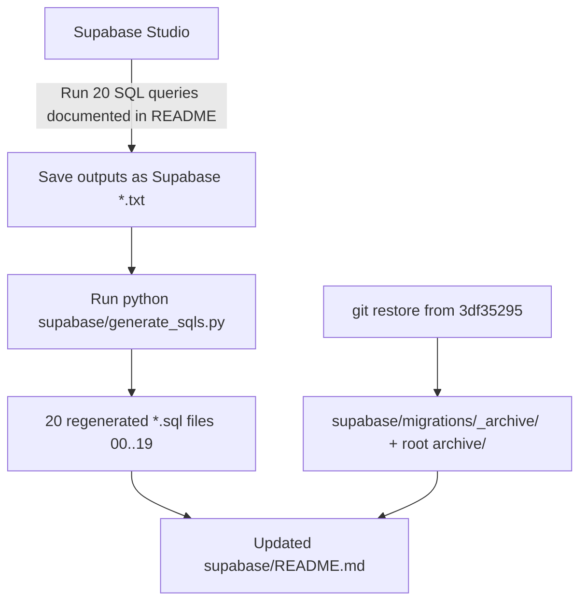

I have created the following plan after thorough exploration and analysis of the codebase. Follow the below plan verbatim. Trust the files and references. Do not re-verify what's written in the plan. Explore only when absolutely necessary. First implement all the proposed file changes and then I'll review all the changes together at the end.

## Observations

- The 20 generated files in `file:supabase/` clearly came from a Python generator, but `generate_sqls.py` is **not on disk and not in git history** (no matches for `generate_sqls` anywhere). Only its outputs and `file:supabase/REGENERATION_PLAN.md` exist.
- I verified the bugs first-hand: literal `\n` strings appear in `file:supabase/04_tables.sql` and `file:supabase/03_role_memberships.sql`; `file:supabase/02_schema_acl.sql`, `05_primary_keys.sql`, `06_foreign_keys.sql`, `07_table_owners.sql` are header-only stubs; `file:supabase/14_policies.sql` contains markdown pipes (`|`) and dangling `FROM profiles` fragments from a naive split parser.
- The 20 source `Supabase *.txt` snapshots are present and untouched (e.g. `file:supabase/Supabase POLICIES.txt`, `file:supabase/Supabase TABLE COLUMNS.txt`).
- Commit `3df35295` (the parent of `HEAD`) holds the full pre-regeneration state: ~30 files in `supabase/migrations/` and ~25 ad-hoc `.sql` files at `file:supabase/` root — all suitable for `git restore`.
- `file:supabase/README.md` already has minimal "File Layout" + "Regeneration Workflow" sections; they need to be expanded per Fix 13 & 15.

## Approach

Since `generate_sqls.py` is missing from disk, the plan treats it as **a new artifact to author from scratch** at `file:supabase/generate_sqls.py`, designed to satisfy all 12 generator fixes against the existing `Supabase *.txt` snapshots. Then regenerate the 20 `.sql` files, restore the deleted migrations from commit `3df35295` into a new `_archive/` directory, and expand `file:supabase/README.md` with the file-layout table and Studio queries used to refresh the snapshots.

> [!WARNING]
> **Truncation safeguard**: This plan is long enough to be truncated in chat history. Step 0 below mandates persisting the plan to `file:supabase/REGENERATION_PLAN_V2.md` verbatim **before any other work**, so the executor can re-read it from disk at any point.

> [!IMPORTANT]
> **Open question for you**: I could not find `generate_sqls.py` anywhere on disk or in git history — only its outputs exist. Confirm one of:
> 1. Author a fresh `generate_sqls.py` (this plan assumes this), OR
> 2. You'll paste the existing version first so I can plan diff-style fixes, OR
> 3. Skip the script and hand-edit the 20 `.sql` files.

> [!IMPORTANT]
> **Second open question**: For the Supabase Studio queries documented in `README.md` (Fix 13), this plan assumes standard `information_schema` / `pg_catalog` queries that reproduce each snapshot. Confirm or provide your own.

## High-Level Flow

## Implementation Instructions

### 0. Persist this plan to disk (do this first)

Before touching any other file, save the **entire content of this plan** verbatim to `file:supabase/REGENERATION_PLAN_V2.md` (create if missing, overwrite if present). Include every section: Observations, Approach, High-Level Flow, all numbered steps (0–5), the File Layout table, the per-emitter requirements table, and both open questions. This file becomes the single durable reference for the rest of execution; the executor must re-read it from disk whenever continuing the work, instead of relying on chat history.

After saving, proceed to Step 1.

### 1. Author `file:supabase/generate_sqls.py` (new file)

Create a single Python 3 script (stdlib only — no new deps in `package.json` or `pyproject`) with one `parse_*` + `emit_*` pair per snapshot. All parsers share these conventions:

- Read the matching `Supabase *.txt` from the script's directory (use `pathlib.Path(__file__).parent`).
- Strip Supabase Studio's pipe/whitespace formatting: split each row by `|`, `.strip()` every cell, and skip header / separator (`---`) lines. Use a **stateful row reader** that joins continuation lines (lines starting with whitespace and not matching the row pattern) to the previous row before splitting — this is the root cause of the `14_policies.sql` corruption and must be applied to every parser.
- Each emitter writes a file with the standard header (filename, source `.txt`, `Last sync`, `DO NOT EDIT MANUALLY`) already used in the current outputs.
- Use real `\n` characters (not the two-character literal `"\\n"`). Build column lists with `"\n  ".join(cols)`, never `"\\n  ".join(cols)` — this is **Fix 1**.
- A central `MANAGED_SCHEMAS` constant (`{"auth", "cron", "extensions", "graphql", "graphql_public", "net", "pgsodium", "pgsodium_masks", "realtime", "storage", "supabase_functions", "supabase_migrations", "vault"}`) and a `is_managed(schema)` helper used by every emitter to skip Supabase-managed objects unless the file is explicitly an inventory.

Per-emitter requirements (each maps 1:1 to a numbered fix):

| Fix | Emitter | Required behavior |
|---|---|---|
| 1 | `emit_04_tables` | Group columns by `(schema, table)`, emit `CREATE TABLE IF NOT EXISTS "schema"."table" (\n  "col" type [NOT NULL] [DEFAULT ...],\n  ...\n);` using real newlines. Map `ARRAY` → keep as `ARRAY` only when source provides element type, otherwise inspect default to recover element type (`text[]`, `jsonb[]`). |
| 2 | `emit_08_functions` | Emit **comment-only inventory** (`-- public.fn_name(args) RETURNS ... LANGUAGE ... SECURITY ...`). No `CREATE OR REPLACE FUNCTION` stubs. Skip rows whose schema is in `MANAGED_SCHEMAS`. Add a top-of-file note explaining that real definitions live in Supabase Studio. |
| 3 | `emit_14_policies` | Use a **multi-line row reader** (described above). For each policy row, extract `schemaname`, `tablename`, `policyname`, `permissive`, `roles`, `cmd`, `qual`, `with_check`. Emit `DROP POLICY IF EXISTS "name" ON "schema"."table"; CREATE POLICY "name" ON "schema"."table" AS PERMISSIVE FOR <cmd> TO <roles> [USING (<qual>)] [WITH CHECK (<with_check>)];`. Wrap `qual` and `with_check` in `(` `)` only if not already wrapped. Skip when value is the literal `null`. |
| 4 | `emit_02_schema_acl` | Parse `Supabase SCHEMA ACL.txt` (cols: `schema_name`, `grantee`, `privilege_type`, `is_grantable`). Emit `GRANT <privilege_type> ON SCHEMA "<schema>" TO "<grantee>"[ WITH GRANT OPTION];`. Skip managed schemas. |
| 4 | `emit_05_primary_keys` | Parse `Supabase PRIMARY KEYS.txt`, group by `(schema, table, constraint_name)`, order by `ordinal_position`, emit `ALTER TABLE "schema"."table" ADD CONSTRAINT "pk_name" PRIMARY KEY ("col1","col2");`. |
| 4 | `emit_06_foreign_keys` | Parse `Supabase FOREIGN KEYS.txt`, group columns by constraint, emit `ALTER TABLE ... ADD CONSTRAINT ... FOREIGN KEY (...) REFERENCES ...(...) ON DELETE ... ON UPDATE ...;`. Default missing actions to `NO ACTION`. |
| 4 | `emit_07_table_owners` | Parse `Supabase TABLE OWNERS.txt`, emit `ALTER TABLE "schema"."table" OWNER TO "<owner>";`. |
| 5 | `emit_04_tables` (audit) | Add an assertion at the end of generation: build a `set` of expected core tables (`tenants`, `profiles`, `sales`, `purchases`, `farms`, `subscriptions`, etc. — load from a `CORE_TABLES` constant) and `print` a warning if any is missing from the parsed input. Do not silently truncate on long files; read the whole file with `Path.read_text(encoding='utf-8')`. |
| 6 | `emit_03_role_memberships` | Use a `DO $ BEGIN ... END $;` block. Each grant becomes `EXECUTE 'GRANT "<role>" TO "<member>"';` with an `EXCEPTION WHEN undefined_object THEN NULL;` block per statement (or one outer block per role). Real newlines between statements. |
| 7 | `emit_01_schemas` | Skip rows where `schema_name` starts with `pg_temp_`, `pg_toast_temp_`, or is in `MANAGED_SCHEMAS` (except `public` and project-custom schemas like `internal`, `rpc`). Keep `CREATE SCHEMA IF NOT EXISTS` + `ALTER SCHEMA ... OWNER TO`. |
| 8 | `emit_12_triggers` | Group rows by `(schema, table, trigger_name)`, collapse multiple `event_manipulation` rows into one `CREATE TRIGGER` with `BEFORE/AFTER <evt1> OR <evt2> OR <evt3>`. Schema-qualify the trigger function: `EXECUTE FUNCTION "public"."fn_name"()` (default to function's actual schema from snapshot, or `public` if unknown). One `DROP TRIGGER IF EXISTS` per trigger, not per event. |
| 9 | `emit_15..19_*` | Centralize grant emission through a `emit_grant(priv, obj_type, obj, role)` helper that: (a) deduplicates via a `set` of `(priv, obj, role)` tuples; (b) writes `PUBLIC` unquoted (never `"PUBLIC"`); (c) skips internal tables (`pg_*`, `_prisma_migrations`, `schema_migrations`); (d) for `anon`, restricts to `SELECT` on tables explicitly tagged as public-readable in `Supabase PUBLIC AND ANON ACCESS.txt` (not blanket `ALL`). |
| 10 | `emit_09_security_definer_functions` | Parse function signature including arg types from `Supabase SECURITY DEFINER FUNCTIONS.txt`. Emit `ALTER FUNCTION "schema"."fn_name"(arg1_type, arg2_type) SECURITY DEFINER SET search_path = public, pg_temp;`. Never emit `ALTER FUNCTION foo()` without arg types. |
| 11 | `emit_11_views` | Skip any row where `view_definition` cell is `null`, empty, or only whitespace. Emit `CREATE OR REPLACE VIEW "schema"."view" AS <def>;` followed by optional `ALTER VIEW ... OWNER TO ...;`. |
| 12 | `emit_13_rls_status` | For each table row in `Supabase TABLES + RLS STATUS.txt`, emit `ALTER TABLE "schema"."table" ENABLE ROW LEVEL SECURITY;` if `rowsecurity = true`, **and** `ALTER TABLE ... FORCE ROW LEVEL SECURITY;` when the snapshot column `forcerowsecurity` (or equivalent) is `true`. Add a `SENSITIVE_TABLES` constant (`payments`, `audit_logs`, `subscriptions`, `tenant_billing`, etc., from `file:supabase/README.md` §6.3) that always gets `FORCE` even if the snapshot omits it. |

A `main()` driver iterates a list of `(emit_fn, output_filename)` pairs and writes each file with `pathlib.Path.write_text(..., encoding='utf-8', newline='\n')`.

### 2. Regenerate the 20 SQL files

Run `python supabase/generate_sqls.py` once and let it overwrite `00_extensions.sql` … `19_public_anon_access.sql`. No manual edits to the outputs.

### 3. Restore migrations into an archive folder (Fix 14)

Run, from the repo root:

- `git restore --source=3df35295d28cf1d9c72ec0947af05c6a2a8afcdd -- supabase/migrations/`
- `git restore --source=3df35295d28cf1d9c72ec0947af05c6a2a8afcdd -- 'supabase/*.sql'` (limited to root-of-`supabase` ad-hoc files: `add_auto_scraper_source.sql`, `audit_*`, `egg_broker_migration.sql`, `emergency_rls_restore.sql`, `fix_*`, `phase_*`, `schema.sql`, `security_patch.sql`, `verify_security_hardening.sql`, plus the `20260506_*` and `20260508_*` series).

Then, **without losing history**:

- Create directory `supabase/migrations/_archive/`.
- `git mv supabase/migrations/<every_sql_file> supabase/migrations/_archive/`.
- Create directory `supabase/migrations/_archive/root/`.
- `git mv supabase/<each_restored_root_sql> supabase/migrations/_archive/root/`.

Finally add a `supabase/migrations/_archive/README.md` explaining: these files are the historical ad-hoc migrations, kept for reference only; the live database state is now represented by `00_*.sql` … `19_*.sql` regenerated from Studio snapshots.

Update `file:supabase/.gitignore` if it currently masks `*.sql` under `migrations/` (verify it does not — current `.gitignore` should be reviewed during the change).

### 4. Update `file:supabase/README.md`

Replace the current "File Layout" bullet list with a 3-column table covering all 20 files (Fix 15):

| # | SQL File | Source `.txt` snapshot | Purpose |
|---|---|---|---|
| 00 | `00_extensions.sql` | `Supabase EXTENSIONS.txt` | Enable Postgres extensions |
| 01 | `01_schemas.sql` | `Supabase SCHEMAS.txt` | Create non-managed schemas |
| 02 | `02_schema_acl.sql` | `Supabase SCHEMA ACL.txt` | `GRANT USAGE/CREATE ON SCHEMA` |
| 03 | `03_role_memberships.sql` | `Supabase ROLE MEMBERSHIPS.txt` | `GRANT <role> TO <member>` (PL/pgSQL) |
| 04 | `04_tables.sql` | `TABLES + RLS STATUS.txt` + `TABLE COLUMNS.txt` | `CREATE TABLE` definitions |
| 05 | `05_primary_keys.sql` | `Supabase PRIMARY KEYS.txt` | `ADD CONSTRAINT ... PRIMARY KEY` |
| 06 | `06_foreign_keys.sql` | `Supabase FOREIGN KEYS.txt` | `ADD CONSTRAINT ... FOREIGN KEY` |
| 07 | `07_table_owners.sql` | `Supabase TABLE OWNERS.txt` | `ALTER TABLE ... OWNER TO` |
| 08 | `08_functions.sql` | `Supabase FUNCTIONS.txt` | Inventory comment listing of all functions |
| 09 | `09_security_definer_functions.sql` | `Supabase SECURITY DEFINER FUNCTIONS.txt` | `ALTER FUNCTION ... SECURITY DEFINER SET search_path` |
| 10 | `10_enabled_extension_functions.sql` | `Supabase ENABLED EXTENSION FUNCTIONS.txt` | Read-only inventory of extension-provided functions |
| 11 | `11_views.sql` | `Supabase VIEWS.txt` | `CREATE OR REPLACE VIEW` |
| 12 | `12_triggers.sql` | `Supabase TRIGGERS.txt` | `CREATE TRIGGER` (events grouped) |
| 13 | `13_rls_status.sql` | `TABLES + RLS STATUS.txt` | `ENABLE / FORCE ROW LEVEL SECURITY` |
| 14 | `14_policies.sql` | `Supabase POLICIES.txt` | `CREATE POLICY` |
| 15 | `15_table_privileges.sql` | `Supabase TABLE PRIVILEGES.txt` | Default privileges |
| 16 | `16_table_grants.sql` | `Supabase TABLE GRANTS.txt` | `GRANT ... ON TABLE` |
| 17 | `17_column_grants.sql` | `Supabase COLUMN GRANTS.txt` | `GRANT (col,...) ON ...` |
| 18 | `18_function_execute_grants.sql` | `Supabase FUNCTION EXECUTE GRANTS.txt` | `REVOKE/GRANT EXECUTE ON FUNCTION` |
| 19 | `19_public_anon_access.sql` | `Supabase PUBLIC AND ANON ACCESS.txt` | Final `anon`/`PUBLIC` surface |

Expand "Regeneration Workflow" to spell out the cycle:

1. In Supabase Studio SQL editor, run each of the 20 queries (documented in §Studio Queries below).
2. Save each output as the matching `Supabase *.txt` in `file:supabase/`.
3. Run `python supabase/generate_sqls.py` from the repo root.
4. Review `git diff supabase/0*.sql supabase/1*.sql` and commit.

Add a new section **"Studio Snapshot Queries"** (Fix 13) listing the 20 SQL queries copy-pastable into Studio. Use standard `information_schema` / `pg_catalog` queries (e.g., `SELECT * FROM pg_policies` for policies, `SELECT * FROM information_schema.columns WHERE table_schema NOT IN (...)` for columns, `SELECT * FROM pg_extension JOIN pg_namespace …` for extensions, etc.). Pending your confirmation on Open Question 2.

Add a new section **"Migration Strategy"** noting:

- Schema changes are now made in Supabase Studio, then re-snapshotted; ad-hoc `.sql` migrations under `supabase/migrations/` are deprecated and archived at `supabase/migrations/_archive/`.
- For changes that must be reproducible across environments (e.g., a brand-new staging DB), apply files `00_*.sql` … `19_*.sql` in numeric order.

### 5. Verification (manual)

- Confirm `file:supabase/REGENERATION_PLAN_V2.md` exists on disk and matches this plan verbatim (Step 0).

After regeneration:

- Open `file:supabase/04_tables.sql` and confirm columns are on separate lines (no literal `\n`).
- Open `file:supabase/14_policies.sql` and confirm no `|` characters or stray `FROM profiles` fragments remain; spot-check `breeding_cycles_*` and `deliveries_*` policies are well-formed.
- Open `file:supabase/08_functions.sql` and confirm only `--` comment lines, no `CREATE OR REPLACE FUNCTION`.
- Open `file:supabase/02_schema_acl.sql`, `05_primary_keys.sql`, `06_foreign_keys.sql`, `07_table_owners.sql` and confirm they now contain real `GRANT` / `ALTER TABLE` statements, not just header comments.
- Confirm `supabase/migrations/_archive/` exists and contains every previously deleted file, with `git log --follow` still resolving each one's history.
- Confirm `file:supabase/README.md` renders the new 20-row File Layout table.
